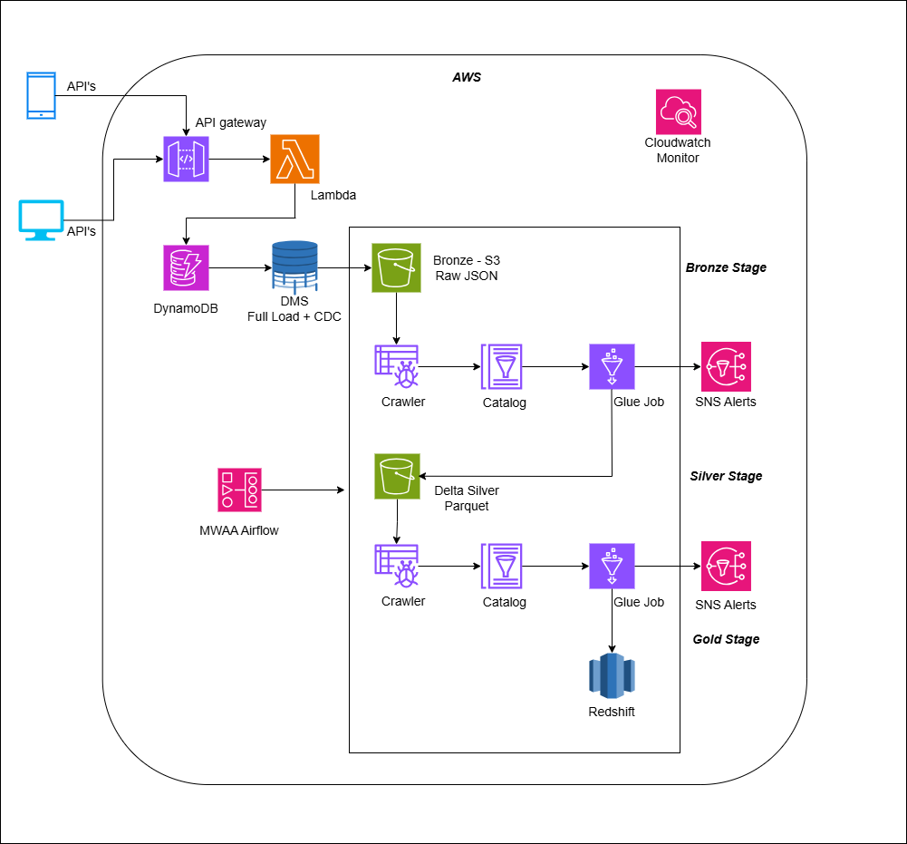

# Enterprise Retail Lakehouse Platform

## Project Overview

This project demonstrates the design and implementation of a scalable cloud-native batch lakehouse platform using AWS services, PySpark, Delta Lake, Apache Airflow, and Terraform.

The platform ingests semi-structured retail event data from operational systems, processes incremental CDC data, and builds analytics-ready datasets using a Medallion Lakehouse Architecture.

The solution is designed to simulate real-world enterprise data engineering challenges including:

- CDC ingestion
- schema evolution
- incremental ETL
- Delta Lake optimization
- orchestration reliability
- monitoring and alerting
- scalable analytics processing

---

# Architecture



```text
Client Applications / APIs
            ↓
API Gateway
            ↓
AWS Lambda
            ↓
Amazon DynamoDB
            ↓
AWS DMS (Full Load + CDC)
            ↓
Amazon S3 Bronze Layer (Raw JSON/Parquet)
            ↓
Glue Crawlers + Glue Catalog
            ↓
AWS Glue PySpark ETL Jobs
            ↓
Delta Lake Silver Layer
            ↓
Business Aggregation Glue Jobs
            ↓
Delta Lake Gold Layer
            ↓
Amazon Athena / Amazon Redshift
            ↓
Business Analytics & Reporting

Workflow Orchestration:
Amazon MWAA (Apache Airflow)

Infrastructure Provisioning:
Terraform

Monitoring & Alerting:
CloudWatch + SNS
```

---

# Business Use Case

The platform simulates an enterprise retail analytics system where customer, payment, product, and order events are continuously generated from APIs and operational applications.

The goal of the platform is to:

- ingest raw semi-structured event data
- process incremental changes using CDC
- transform and standardize data
- create analytics-ready business datasets
- optimize query performance for large-scale analytics workloads

---

# Tech Stack

## AWS Services

- AWS Lambda
- Amazon API Gateway
- Amazon DynamoDB
- AWS DMS
- Amazon S3
- AWS Glue
- AWS Glue Catalog
- AWS Glue Crawlers
- Amazon Athena
- Amazon Redshift
- Amazon MWAA (Airflow)
- Amazon CloudWatch
- Amazon SNS
- AWS IAM

## Data Engineering Technologies

- PySpark
- Delta Lake
- Apache Airflow
- Terraform
- Parquet

---

# Medallion Architecture

The platform follows the Medallion Architecture pattern using Bronze, Silver, and Gold layers.

---

# Bronze Layer — Raw Immutable Storage

The Bronze layer stores raw CDC data ingested from DynamoDB through AWS DMS.

## Features

- Raw immutable storage
- Full load + CDC ingestion
- Semi-structured JSON event handling
- Historical replay capability
- Partitioned storage for scalable querying

## Storage Format

- JSON
- Parquet

## Example Partition Structure

```text
s3://retail-lakehouse/bronze/orders/year=2026/month=05/day=11/
```

## Example Raw Event

```json
{
  "event_id": "EVT1001",
  "event_type": "ORDER_PLACED",
  "customer": {
    "customer_id": 101,
    "tier": "GOLD"
  },
  "payment": {
    "method": "UPI",
    "status": "SUCCESS"
  },
  "amount": 2500,
  "event_time": "2026-05-11T10:15:00"
}
```

---

# Silver Layer — Cleansed Delta Tables

The Silver layer standardizes, validates, and transforms raw event data into structured Delta Lake tables.

## Features

- JSON flattening
- Schema normalization
- Deduplication
- Data quality validation
- Incremental CDC MERGE operations
- Idempotent ETL design
- Schema evolution handling

## Delta Lake Features Used

- MERGE INTO
- mergeSchema
- Time Travel
- ACID transactions
- Checkpointing

## Transformations Performed

- Flatten nested JSON
- Remove duplicates
- Handle malformed records
- Standardize schemas
- Apply CDC updates
- Validate business rules

---

# Gold Layer — Business Analytics Tables

The Gold layer contains business-ready aggregated datasets optimized for reporting and analytics.

## Features

- KPI aggregations
- Analytics-ready datasets
- Optimized query performance
- Reporting-focused Delta tables

## Example Analytics

- Daily sales metrics
- Customer spending trends
- Product category performance
- Failed payment analytics
- Revenue dashboards

---

# Incremental CDC Processing

AWS DMS is configured using:

```text
Full Load + CDC
```

The platform supports:

- INSERT events
- UPDATE events
- DELETE events
- UPSERT processing

Delta Lake MERGE operations are used to maintain:

- idempotency
- consistency
- incremental synchronization

---

# Delta Lake Optimizations

## File Optimization

- OPTIMIZE
- File compaction
- Repartitioning

## Query Optimization

- ZORDER
- Partition pruning
- Predicate pushdown

## Maintenance

- VACUUM
- Delta checkpoints
- Metadata optimization

---

# Spark Optimization Techniques

The ETL jobs implement several Spark optimization strategies:

- Adaptive Query Execution (AQE)
- Broadcast joins
- Partition optimization
- Shuffle minimization
- Predicate pushdown
- Efficient repartitioning
- Optimized parquet sizing

---

# Airflow Orchestration

Amazon MWAA (Managed Airflow) is used for workflow orchestration.

## DAG Responsibilities

- Trigger Glue jobs
- Manage task dependencies
- Retry failed jobs
- Handle scheduling
- Send failure notifications
- Monitor ETL execution

---

# Monitoring & Alerting

## Monitoring

Amazon CloudWatch is used for:

- Glue job monitoring
- ETL execution tracking
- Error logging
- Pipeline health monitoring

## Alerting

Amazon SNS is used for:

- Job failure alerts
- Pipeline retry notifications
- Workflow monitoring alerts

---

# Infrastructure Automation

Terraform is used to provision and manage infrastructure resources.

## Resources Provisioned

- S3 buckets
- Glue jobs
- IAM roles
- MWAA environment
- Redshift resources
- Monitoring infrastructure

## Benefits

- Infrastructure consistency
- Version-controlled deployments
- Reduced configuration drift
- Reproducible environments

---

# Production Challenges Simulated

This project intentionally simulates several enterprise-scale production issues.

---

## 1. Schema Evolution

Incoming events may contain newly added fields.

Handled using:

- mergeSchema
- Delta Lake schema evolution

---

## 2. Small File Problem

Large-scale incremental ingestion generates excessive small parquet files.

Resolved using:

- OPTIMIZE
- File compaction
- Repartitioning

---

## 3. Duplicate CDC Events

Duplicate or replayed CDC events may occur during failures or retries.

Resolved using:

- Delta MERGE
- Primary-key deduplication
- Idempotent ETL design

---

## 4. Slow Athena Queries

Large-scale analytics queries may scan excessive S3 data.

Optimized using:

- Partition pruning
- ZORDER
- Optimized Delta layouts

---

## 5. Pipeline Failure Recovery

ETL failures are handled using:

- Airflow retries
- Checkpoint recovery
- Idempotent processing logic

---

# Security Best Practices

- IAM least privilege access
- Encrypted S3 storage
- Secure secrets handling
- Terraform remote state management
- Restricted production access

---

# Repository Structure

```text
retail-lakehouse-platform/
│
├── README.md
│
├── architecture/
│   └── architecture_diagram.png
│
├── glue_jobs/
│   ├── silver_layer_etl.py
│   └── gold_layer_aggregation.py
│
├── airflow/
│   └── retail_lakehouse_dag.py
│
├── terraform/
│   ├── provider.tf
│   ├── s3.tf
│   ├── glue.tf
│   ├── iam.tf
│   └── mwaa.tf
│
├── sample_data/
│
├── screenshots/
│
└── docs/
```

---

# Key Learnings

This project strengthened practical understanding of:

- cloud-native data engineering
- Delta Lake architecture
- CDC pipeline design
- scalable ETL processing
- Spark optimization
- Airflow orchestration
- Terraform automation
- production-grade lakehouse systems

---

# Future Enhancements

Potential future improvements:

- Real-time streaming integration
- CI/CD deployment pipelines
- Automated data quality framework
- Data lineage implementation
- Kubernetes-based Spark execution
- Iceberg/Hudi comparison implementation

---

# Author

**Zumare Pasha**  
Data Engineer
Focused on AWS, Spark, Delta Lake, Streaming Systems, and Scalable Data Platforms
